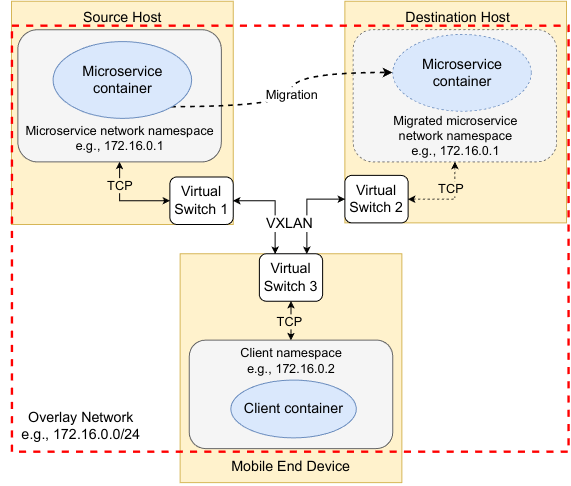

# Container OverlAy TCP (COAT) Migration for Stateful Microservices

We propose a novel network solution, named Container OverlAy TCP (COAT), that is independent of the specific MS and enables stateful microservice migration while preserving its TCP (and, virtually, any transport-layer protocol) connection with the mobile end users.

The benefit of COAT is threefold: 
* It migrates a generic MS container with an established transport-layer connection, avoiding reconnection procedures;
* It preserves all the data queued inside the network socket, thus preventing data losses;
* It performs stateful microservice migration in an agnostic way with respect to either the server or the client side of the connection.

Further details can be found in:

    @inproceedings{yu2023tcp,
        title={{TCP} connection management for stateful container migration at the network edge},
        author={Yu, Yenchia and Calagna, Antonio and Giaccone, Paolo and Chiasserini, Carla Fabiana},
        booktitle={2023 21st Mediterranean Communication and Computer Networking Conference (MedComNet)},
        pages={151--157},
        year={2023},
        organization={IEEE}
    }

This repository includes the code we developed to conduct our experimental validation based on SockPerf and iPerf3 microservices.

## Suggested Testbed
Operating system:
* Ubuntu 20.04 with kernel 5.8.18-050818-generic

Tools:
* Podman 4.4.0
* runc 1.1.6
* CRIU 3.16.1
